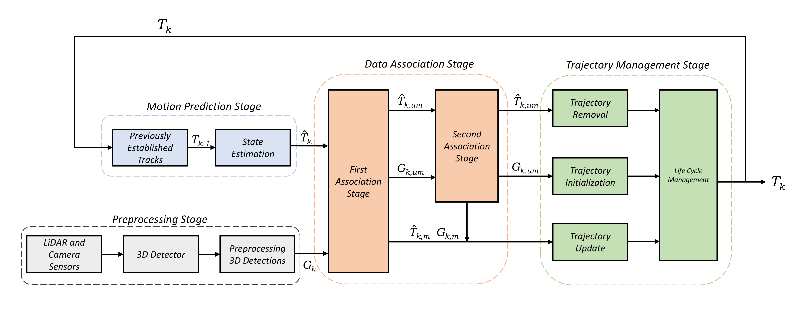
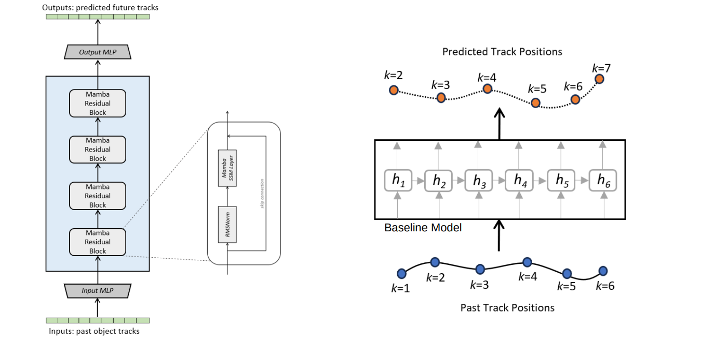
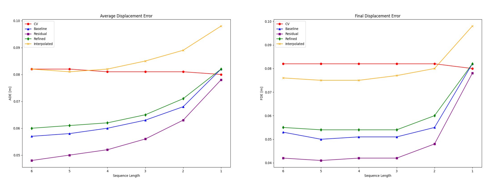

## Selective State Space Model for Multi-Object Prediction and Tracking in Automated Driving

Multi-Object Tracking (MOT) plays a vital role in autonomous driving systems. In MOT, object observations from previous frames are matched with current detections through a process of state estimation and data association. Traditionally, for state estimation, Kalman Filters with classical motion models such as Constant Velocity (CV) are used. However, these motion models operates under linear assumption and are therefore limited in their ability to capture the nonlinear motion dynamics of dynamic objects. This thesis explores the use of Selective State Space Model (Selective SSM) based Mamba models for 3D MOT in automated driving. A baseline Mamba model is designed and implemented for trajectory prediction of the traffic participants. This baseline is trained in a purely data-driven manner, which can lead to overfitting and can make prediction of unrealistic motions, as it lacks the inherent understanding of physical constraints. To address this limitation, three additional Mamba model variants are developed by integrating neural network approaches with physics-informed principles derived from the CV motion model. These trained nonlinear motion models are then incorporated into a 3D multi-object tracker and evaluated using the nuScenes dataset.

## Baseline 

## Object Trajectory Prediction (L=6)

| Model             | ADE (↓) | FDE (↓) |
|------------------|---------|---------|
| Constant Velocity| 0.0816  | 0.0824  |
| Baseline Model         | 0.0579  | 0.0528  |
| Residual Model     | **0.0481**  | **0.0415**  |
| Refined Model          | 0.0597  | 0.0552  |
| Interpolated Model     | 0.0815  | 0.0761  |

## Multi-Object Tracking 

| Model             | AMOTA (↑) | AMOTP (↓) | TP      | FP     | FN     | IDS   |
|------------------|------------|-----------|---------|--------|--------|--------|
| Constant Velocity| **0.725**      | **0.507**     | 84029   | 13064  | 17629  | **239**    |
| Baseline Model         | 0.718      | 0.517     | 82946   | 12851  | 18572  | 379    |
| Residual Model         | 0.716      | 0.518     | 84356   | 14205  | 17221  | 320    |
| Refined Model          | 0.705      | 0.539     | 82637   | 13213  | 18729  | 531    |
| Interpolated Model     | 0.704      | 0.546     | 81404   | 12552  | 19963  | 530    |

## Multi-Object Tracking + KF tuning

| Model                    | AMOTA (↑) | AMOTP (↓) | TP     | FP     | FN     | IDS |
|--------------------------|---------|---------|--------|--------|--------|-----|
| Constant Velocity        | 0.725   | 0.507   | 84029  | 13064  | 17629  | 239 |
| Constant Velocity + QR  | **0.728**   | **0.507**   | 83949  | 12573  | 17725  | **223** |
| Baseline Model           | 0.718   | 0.517   | 82946  | 12851  | 18572  | 379 |
| Baseline Model + QR     | 0.727   | 0.515   | 84907  | 14065  | 16724  | 266 |
| Residual Model           | 0.716   | 0.518   | 84356  | 14205  | 17221  | 320 |
| Residual Model + QR     | 0.724   | 0.526   | 84707  | 14126  | 16967  | **223** |

## Object Trajectory Prediction (on various sequence lengths L)

## Findings

- All the learned motion models outperformed the Constant Velocity (CV) model in the trajectory prediction task, with the Residual Model achieving the best performance.

- In contrast, when evaluated on the multi-object tracking task, the CV model achieved the best tracking accuracy and precision, outperforming the learned models. This highlights a discrepancy between the results of the trajectory prediction and tracking tasks.

- The Q and R matrices of the Kalman Filter were tuned to optimize tracking performance. While this tuning improved results across all models, the CV model still had the best overall tracking performance.

- When evaluating trajectory prediction across various sequence lengths, a sharp drop in performance was observed at sequence lengths L = 2 and L = 1. This indicates that the shorter sequences lack sufficient temporal motion context for reliable predictions.

- A possible explanation for the discrepancy between the trajectory prediction and tracking tasks is that the models may struggle when objects first appear in the scene, due to the lack of long-range temporal context. This can result in early inaccurate predictions, which may cause false positives in tracking and ultimately reduce overall tracking accuracy.
